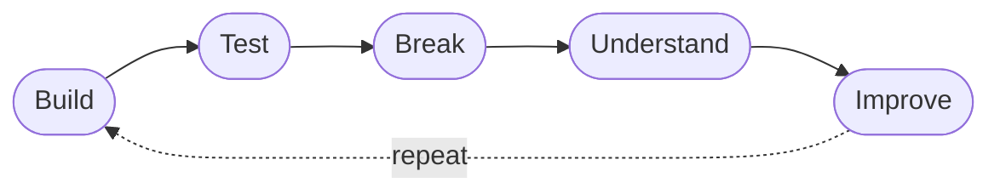

```html
<div align="center">
<picture>
  <source media="(prefers-color-scheme: dark)" srcset="https://capsule-render.vercel.app/api?type=waving&height=280&color=0:0b1020,30:1e1b4b,65:312e81,100:0f766e&text=RAJAN%20SUBBA&fontFamily=Space+Grotesk&fontColor=ffffff&fontSize=56&fontAlignY=38&desc=Developer%20%E2%80%A2%20AI%20Builder%20%E2%80%A2%20Security%20Explorer&descAlignY=66&descSize=17&descAlign=50&animation=fadeIn"/>
  
</picture>

<br/>

<a href="https://github.com/rjr12-blip">

</a>

<br/><br/>


&nbsp;

&nbsp;


<br/><br/>


</div>


<br/>

<div align="center">

<sub><code>[ 01 ]&nbsp;&nbsp;ABOUT</code></sub>

# ⚡ &nbsp;The&nbsp;Operator

</div>

<div align="center">

> *"I build things to understand how they work."*

</div>

<br/>

I'm a developer from **Bhutan** exploring the intersection of **software development, AI, web technologies, and ethical security**.

I'm an **AI-assisted / vibe coder** — I use AI as a development partner, but I care about understanding the code, the architecture, and the systems underneath it.

I like turning ideas into working software, experimenting from **Android** and **Linux** environments, breaking things in controlled environments, and improving what I build.

<br/>

<div align="center">

```text
        ╭─────────────────────────────────────────────╮
        │                                             │
        ▼                                             │
   ┌─────────┐     ┌─────────┐     ┌─────────┐         │
   │  I D E A│ ──▶ │  B U I L D│ ──▶ │  T E S T│         │
   └─────────┘     └─────────┘     └─────────┘         │
                                        │              │
                                        ▼              │
   ┌─────────┐     ┌─────────┐     ┌─────────┐         │
   │I M P R O V E│ ◀── │U N D E R S T A N D│ ◀── │  B R E A K│         │
   └─────────┘     └─────────┘     └─────────┘         │
        │                                             │
        ╰─────────────────────────────────────────────╯
```

</div>

<br/>


<br/>

<div align="center">

<sub><code>[ 02 ]&nbsp;&nbsp;STACK</code></sub>

🛠 &nbsp;Technology&nbsp;Arsenal

<br/>

⚙️ &nbsp;I&nbsp;BUILD&nbsp;WITH


🔍 &nbsp;I&nbsp;EXPLORE


</div>

<br/>


<br/>

<div align="center">

<sub><code>[ 03 ]&nbsp;&nbsp;FOCUS</code></sub>

🧠 &nbsp;Current&nbsp;Focus

</div>

<br/>

```yaml
interests:
  - AI-assisted software development
  - Cyber security (ethical hacking)
  - Web application security
  - Linux and Android environments
  - Secure backend architecture
  - Developer tooling
  - Automation
  - Understanding systems from the inside out

currently:
  exploring:
    - Secure web architecture
    - Offensive security fundamentals
  building:
    - Practical AI tools
    - Web applications with Supabase
```

<br/>


<br/>

<div align="center">

<sub><code>[ 04 ]&nbsp;&nbsp;PHILOSOPHY</code></sub>

🧬 &nbsp;How&nbsp;I&nbsp;Think

<br/>

```bash
while alive; do
  build
  test
  break
  understand
  improve
done
```

<sub><i>The best developers are not just writers of code —
they are <b>system thinkers</b>, <b>curious breakers</b>, and <b>careful rebuilders</b>.</i></sub>


<details>
<summary><b>→ See the loop</b></summary>
<br/>



</details>

</div>

<br/>


<br/>

<div align="center">

<sub><code>[ 05 ]&nbsp;&nbsp;SIGNAL</code></sub>

📡 &nbsp;Telemetry&nbsp;&amp;&nbsp;Activity


<table border="0" cellpadding="0" cellspacing="0" width="100%">
  <tr>
    <td width="100%" align="center">
      <picture>
        <source media="(prefers-color-scheme: dark)" srcset="https://github-readme-stats.vercel.app/api?username=rjr12-blip&show_icons=true&hide_border=true&bg_color=0b1020&title_color=38bdf8&icon_color=2dd4bf&text_color=e2e8f0&ring_color=38bdf8&rank_icon=github"/>
        
      </picture>
    </td>
  </tr>
  <tr>
    <td width="100%" align="center">
      <picture>
        <source media="(prefers-color-scheme: dark)" srcset="https://streak-stats.demolab.com/?user=rjr12-blip&hide_border=true&background=0b1020&ring=38bdf8&fire=2dd4bf&currStreakLabel=38bdf8&sideLabels=cbd5e1&dates=94a3b8"/>
        
      </picture>
    </td>
  </tr>
  <tr>
    <td width="100%" align="center">
      <picture>
        <source media="(prefers-color-scheme: dark)" srcset="https://github-readme-stats.vercel.app/api/top-langs/?username=rjr12-blip&layout=compact&langs_count=8&hide_border=true&bg_color=0b1020&title_color=38bdf8&text_color=e2e8f0"/>
        
      </picture>
    </td>
  </tr>
</table>

<br/>

<picture>
  <source media="(prefers-color-scheme: dark)" srcset="https://raw.githubusercontent.com/rjr12-blip/rjr12-blip/output/github-contribution-grid-snake-dark.svg"/>
  
</picture>

</div>

<br/>


<br/>

<div align="center">

<sub><code>[ 06 ]&nbsp;&nbsp;NOW</code></sub>

🌱 &nbsp;Currently

<br/>

<table>
  <tr>
    <td align="right"><b>📍 Based in</b></td>
    <td align="left">Bhutan · GMT+6</td>
  </tr>
  <tr>
    <td align="right"><b>📚 Learning</b></td>
    <td align="left">AI-assisted engineering &amp; offensive security</td>
  </tr>
  <tr>
    <td align="right"><b>🔨 Building</b></td>
    <td align="left">Practical tools with Supabase backends</td>
  </tr>
  <tr>
    <td align="right"><b>🎯 Goal</b></td>
    <td align="left">Become dangerous in the best possible way</td>
  </tr>
</table>

</div>

<br/>


<br/>

<div align="center">

<sub><code>[ 07 ]&nbsp;&nbsp;UPLINK</code></sub>

🛰️ &nbsp;Establish&nbsp;Connection


<a href="mailto:rajensubba559@gmail.com">
  
</a>
&nbsp;&nbsp;
<a href="https://github.com/rjr12-blip">
  
</a>

</div>

<br/>

<div align="center">


<br/>

<sub><i>Crafted with intent — from the Himalayas to the world 🇧🇹</i></sub>


</div>
```

---
